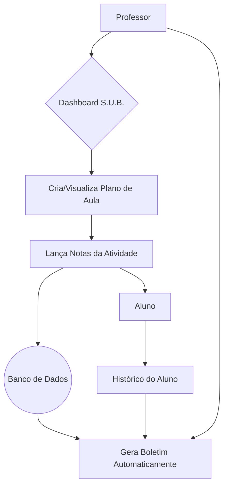

# S.U.B - Sistema Único de Boletim

O S.U.B. é uma plataforma educacional projetada para centralizar e simplificar a gestão de informações acadêmicas. O sistema unifica boletins, notas e planos de aula, otimizando a rotina de professores e coordenadores e melhorando a comunicação com alunos e famílias.

## Índice

- [S.U.B - Sistema Único de Boletim](#sub---sistema-único-de-boletim)
  - [Índice](#índice)
  - [1. Sobre o Projeto](#1-sobre-o-projeto)
    - [Contexto](#contexto)
    - [O Desafio](#o-desafio)
  - [2. Funcionalidades](#2-funcionalidades)
  - [3. Como o S.U.B. integra Boletins, Notas e Planos de Aula?](#3-como-o-sub-integra-boletins-notas-e-planos-de-aula)
  - [4. Tecnologias Utilizadas](#4-tecnologias-utilizadas)
  - [5. Requisitos](#5-requisitos)
    - [Requisitos Funcionais](#requisitos-funcionais)
    - [Requisitos Não Funcionais](#requisitos-não-funcionais)
  - [6. Equipe](#6-equipe)

## 1. Sobre o Projeto

### Contexto

Atualmente, muitas escolas utilizam múltiplos sistemas ou processos manuais para gerenciar a vida acadêmica dos alunos. Isso gera um grande volume de trabalho para educadores, como a professora Mariana Silva, de 40 anos, que precisa lidar com tarefas burocráticas em sistemas desconectados, causando retrabalho e perda de tempo precioso.

Com a crescente demanda por educação digital, o **S.U.B. (Sistema Único de Boletim)** nasce como uma solução para unificar essas ferramentas, tornando a gestão escolar mais eficiente, intuitiva e centralizada.

### O Desafio

O principal desafio do projeto é desenvolver uma plataforma única que integre boletins, notas e planos de aula de forma coesa, com uma interface intuitiva e informações de fácil acesso para todos os usuários.

## 2. Funcionalidades

- ✅ **Plataforma Unificada:** Permite que professores e coordenadores registrem e acessem boletins, notas e planos de aula em um único local.
- 📊 **Relatórios Automáticos:** Gera relatórios de desempenho dos alunos com gráficos e tabelas, facilitando a visualização de dados.
- 👤 **Acompanhamento Individual:** Oferece um histórico completo de cada aluno, incluindo notas, frequência e observações pedagógicas.
- 🔒 **Segurança:** Utiliza autenticação e controle de permissões para garantir a proteção dos dados.

## 3. Como o S.U.B. integra Boletins, Notas e Planos de Aula?

A integração é o pilar central do S.U.B. e é realizada através de uma arquitetura de dados relacional e uma interface de usuário coesa. Veja como funciona:

1. **Banco de Dados Centralizado:** Todas as informações são armazenadas em um único banco de dados. Um `Plano de Aula` está associado a uma `Turma` e a um `Professor`. As `Notas` lançadas em uma atividade estão diretamente ligadas a um `Aluno` específico e ao `Plano de Aula` correspondente.
2. **Geração Automática do Boletim:** O `Boletim` não é um documento preenchido manualmente. Ele é gerado dinamicamente pelo sistema, compilando todas as `Notas` e a `Frequência` de um aluno em um determinado período. Qualquer atualização em uma nota reflete automaticamente no boletim.
3. **Dashboard Intuitivo:** A interface principal é um dashboard que apresenta as informações de forma conectada. O professor pode visualizar seu plano de aula da semana e, com um clique, acessar a tela para lançar as notas daquela aula específica. Da mesma forma, ao visualizar o perfil de um aluno, ele tem acesso imediato ao seu boletim atualizado e histórico de notas.

Essa abordagem elimina a necessidade de inserir a mesma informação em múltiplos lugares, reduzindo erros e economizando tempo.

## 4. Tecnologias Utilizadas

O projeto foi desenvolvido com as seguintes tecnologias:

- **Frontend:** `HTML5` e `CSS3` para criar uma interface de usuário limpa, responsiva e intuitiva.
- **Backend:** `Java` para gerenciar a lógica de negócio, segurança e a comunicação com o banco de dados.
- **Bibliotecas:** Bibliotecas Java para a geração de gráficos e relatórios visuais.

## 5. Requisitos

### Requisitos Funcionais

- Unificação de informações (boletins, notas, planos de aula).
- Geração de relatórios automáticos e visuais.
- Cadastro e acompanhamento individual do histórico do aluno.

### Requisitos Não Funcionais

- **Usabilidade:** Interface simples e de fácil navegação.
- **Desempenho:** Respostas a ações do usuário em menos de 3 segundos.
- **Segurança:** Autenticação segura e controle de permissões de acesso.
- **Disponibilidade:** Sistema disponível 24/7 com 99% de uptime.

## 6. Equipe

- Lucas Santos
- Rafael Teixeira
